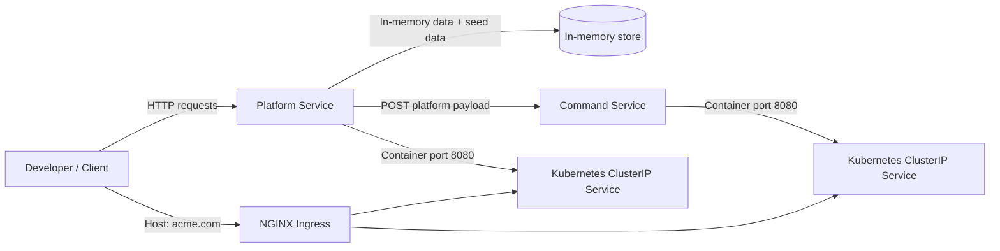

# Less Jackson Microservices

Course: https://youtu.be/DgVjEo3OGBI?si=-7wme82-oG4BsvxJ

Two .NET 10 microservices that demonstrate a simple platform-and-commands workflow:

- Platform Service stores and serves platform data.
- Command Service receives synchronized platform events from Platform Service.
- Kubernetes manifests are included for deployment, service exposure, and ingress routing.

## Architecture



### Runtime flow

1. Platform Service starts, seeds three sample platforms, and keeps data in memory.
2. Creating a platform in Platform Service persists it to the in-memory store.
3. Platform Service then sends the same platform payload to Command Service through `HttpClient`.
4. In Kubernetes, traffic can come in through NGINX Ingress and be routed to the correct service by path.

## Services

### Platform Service

- Location: [PlatformService](PlatformService)
- Main API: `/api/platforms`
- Local launch URLs:
  - HTTP: `http://localhost:5054`
  - HTTPS: `https://localhost:7221`
- Container port: `8080`
- Storage: EF Core in-memory database named `InMem`
- Startup seeding: `Dot Net`, `SQL Server Express`, and `Kubernetes`
- Outbound sync target: `http://commandservice-clusterip-srv:8080/api/command/platforms`

### Command Service

- Location: [CommandService](CommandService)
- Main API: `/api/command/platforms`
- Local launch URLs:
  - HTTP: `http://localhost:5073`
  - HTTPS: `https://localhost:7290`
- Container port: `8080`
- Behavior: accepts POST requests and logs the inbound call

## Project Layout

- [PlatformService](PlatformService) - primary platform API, repository, sync client, and in-memory data setup
- [CommandService](CommandService) - command receiver API
- [K8S](K8S) - Kubernetes manifests for deployments, services, node port, and ingress
- [K8-CheatSheet.txt](K8-CheatSheet.txt) - kubectl command reference

## First-Time Setup

### Prerequisites

- .NET 10 SDK
- Docker Desktop or another Docker engine
- Kubernetes cluster enabled locally or available remotely
- `kubectl`

### Local run without Docker

1. Restore and run Platform Service.

   ```powershell
   cd PlatformService
   dotnet restore
   dotnet run
   ```

2. In a second terminal, restore and run Command Service.

   ```powershell
   cd CommandService
   dotnet restore
   dotnet run
   ```

3. Verify the APIs.

   ```powershell
   curl http://localhost:5054/api/platforms
   curl http://localhost:5073/api/command/platforms
   ```

### Local run with Docker

Each service has a multi-stage Dockerfile.

Build and run Platform Service:

```powershell
cd PlatformService
docker build -t rahul1994jh/platformservice:latest .
docker run -d -p 8080:8080 --name platformservice rahul1994jh/platformservice:latest
```

Build and run Command Service:

```powershell
cd CommandService
docker build -t rahul1994jh/commandservice:latest .
docker run -d -p 8081:8080 --name commandservice rahul1994jh/commandservice:latest
```

Useful Docker checks:

```powershell
docker ps
docker logs platformservice
docker logs commandservice
docker stop platformservice
docker stop commandservice
```

## Kubernetes Setup

The manifests live in [K8S](K8S).

### Manifests

- [platforms-depl.yaml](K8S/platforms-depl.yaml) - Platform Service deployment plus ClusterIP service
- [commands-depl.yaml](K8S/commands-depl.yaml) - Command Service deployment plus ClusterIP service
- [platforms-np-srv.yaml](K8S/platforms-np-srv.yaml) - NodePort service for Platform Service
- [ingress-srv.yaml](K8S/ingress-srv.yaml) - NGINX ingress routing for `acme.com`

### Apply the manifests

Apply the services and deployments:

```powershell
kubectl apply -f .\K8S\platforms-depl.yaml
kubectl apply -f .\K8S\commands-depl.yaml
```

Optional: expose Platform Service through NodePort for direct cluster access:

```powershell
kubectl apply -f .\K8S\platforms-np-srv.yaml
```

Optional: apply ingress routing after the NGINX ingress controller is installed:

```powershell
kubectl apply -f .\K8S\ingress-srv.yaml
```

### Kubernetes routing model

- Platform Service listens on container port `8080`.
- Command Service listens on container port `8080`.
- `platformservice-clusterip-srv` exposes Platform Service inside the cluster.
- `commandservice-clusterip-srv` exposes Command Service inside the cluster.
- NodePort service `platformnpservice-srv` exposes Platform Service on port `80` inside the cluster and maps it to a node port.
- Ingress host `acme.com` routes:
  - `/api/platforms` to `platformservice-clusterip-srv`
  - `/api/command/platforms` to `commandservice-clusterip-srv`

### Ingress prerequisites

The ingress manifest assumes:

- an NGINX ingress controller is installed
- the cluster can resolve and route traffic for `acme.com`
- the ClusterIP services already exist

If you are testing locally, you may need a hosts-file entry or equivalent DNS mapping for `acme.com`.

### Common Kubernetes commands

```powershell
kubectl get deployments
kubectl get pods
kubectl get services
kubectl get ingress
kubectl describe deployment platformservice-deployment
kubectl describe deployment commandservice-deployment
kubectl logs -l app=platformservice
kubectl logs -l app=commandservice
kubectl rollout status deployment/platformservice-deployment
kubectl rollout status deployment/commandservice-deployment
```

## API Endpoints

### Platform Service

- `GET /api/platforms` - list all platforms
- `GET /api/platforms/{id}` - get one platform
- `POST /api/platforms` - create a platform and sync it to Command Service

Example payload:

```json
{
  "name": "Docker",
  "publisher": "Docker Inc.",
  "cost": "Free"
}
```

### Command Service

- `POST /api/command/platforms` - receives platform sync payloads

## Notes

- Platform Service currently uses EF Core InMemory, so no external database is required for first-time setup.
- The repo currently does not include a solution file at the root, so run each service from its own project folder.
- The included `K8-CheatSheet.txt` has extra `kubectl` examples if you want a quick reference.
